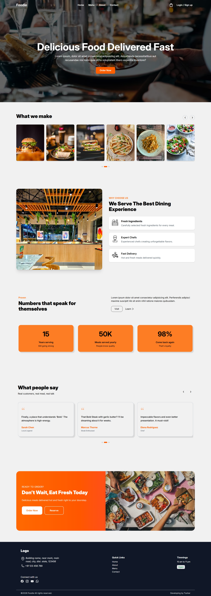
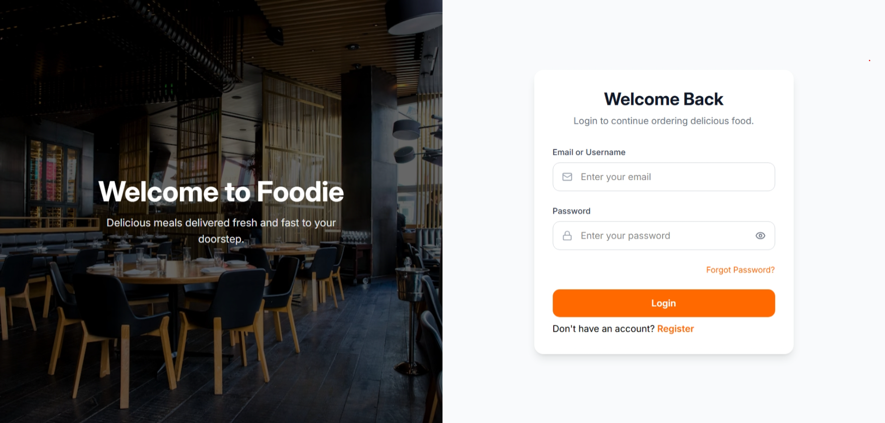
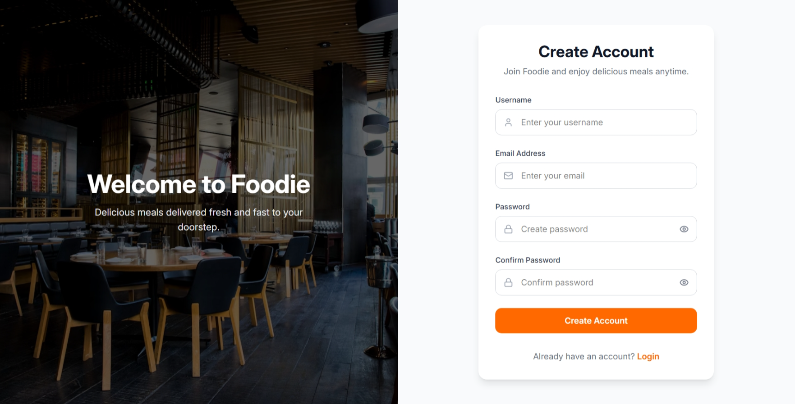
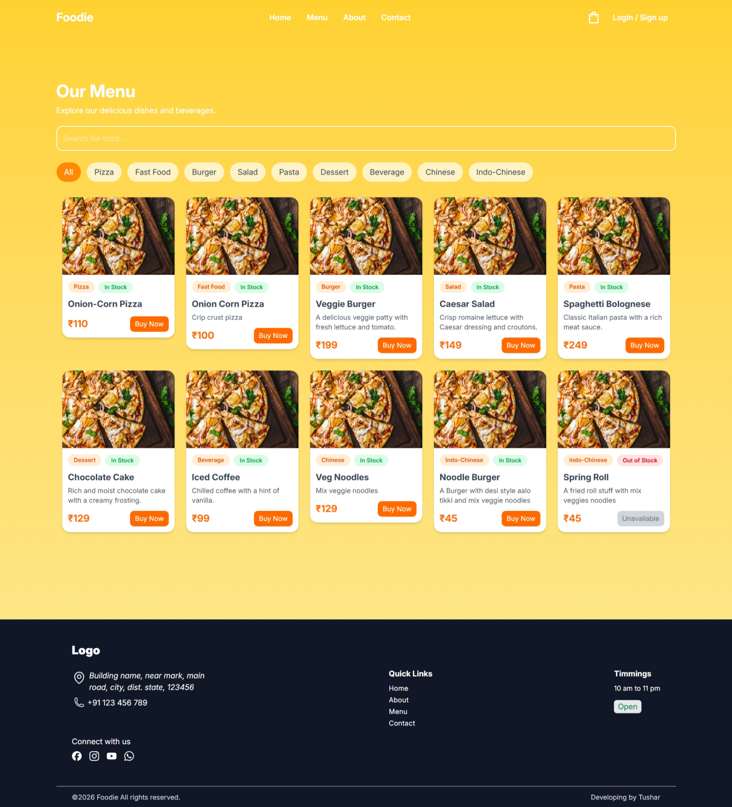

# 🍽️ Restaurant Management System

A full-stack Restaurant Management System built using the MERN Stack. This application allows customers to browse food items, create accounts, log in securely, and manage their food ordering experience. The project also includes role-based access control for administrators to manage restaurant operations.

## 🚀 Features

### Customer Features
- User Registration & Login
- Secure Authentication using JWT
- Browse Restaurant Menu
- Search Food Items
- Filter Food by Categories
- Responsive Design for Mobile & Desktop
- Add Items to Cart
- Persistent Login using Cookies
- About Page

### Admin Features
- Add Food Items
- Update Food Items
- Delete Food Items
- Protected Routes
- Role-Based Authorization

---

## 🛠️ Tech Stack

### Frontend
- React.js
- React Router DOM
- Tailwind CSS
- Context API
- Fetch API

### Backend
- Node.js
- Express.js
- MongoDB
- Mongoose
- JWT Authentication
- Express Validator
- Cookie Parser
- Bcrypt.js

---

## 📂 Project Structure

```text
RESTAURANT-APP
│
├── client
│   ├── src
│   ├── public
│   └── package.json
│
├── server
│   ├── controllers
│   ├── models
│   ├── routes
│   ├── middlewares
│   ├── validators
│   └── package.json
│
├── README.md
└── .gitignore
```

---

## ⚙️ Installation

### Clone Repository

```bash
git clone <your-repository-url>
cd RESTAURANT-APP
```

### Backend Setup

```bash
cd server
npm install
HEAD
npm run dev

```

Create `.env` file inside server directory:

```env
PORT=5000
MONGO_URI=your_mongodb_connection_string
JWT_SECRET=your_jwt_secret
NODE_ENV=development
```

Run Backend:

```bash
npm run dev
```

---

### Frontend Setup

```bash
cd client
npm install
npm run dev
```

Frontend runs on:

```text
http://localhost:5173
```

Backend runs on:

```text
http://localhost:5000
```

---

## 🔐 Authentication

This project uses:

- JWT Authentication
- HTTP Only Cookies
- Protected Routes
- Role-Based Access Control

Roles:

- User
- Admin

---

## 📸 Screenshots

### Home Page



### Authentication




### Menu Page



### About Page

(Add screenshot here)

---

## 🧩 Future Enhancements

- Checkout System
- Order Placement
- Order History
- Payment Gateway Integration
- Admin Dashboard Analytics
- Food Image Upload using Cloudinary
- Wishlist Feature
- Reviews & Ratings

---

## 👨‍💻 Author

**Tushar Dumra**

- LinkedIn: https://www.linkedin.com/in/tushar-dumra/
- GitHub: https://github.com/tushardumra

---

## 📄 License

This project is developed for learning and portfolio purposes.
 2fb130c (Adding client folder built UI till About page)
